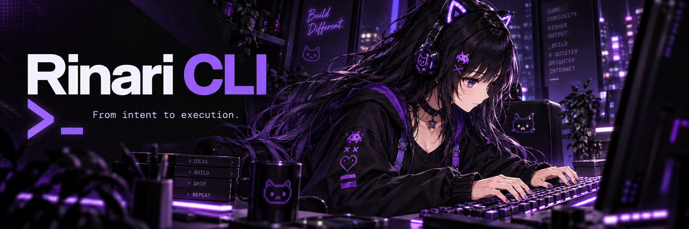
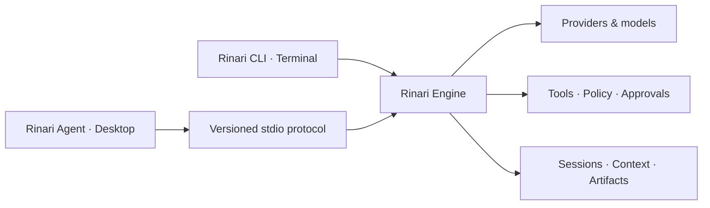

<div align="center">



# Rinari CLI

**Your terminal. An agent that can work with it.**

Explore a codebase, plan a change, run tools and review the evidence.
Persistent context and controlled execution, in the workflow you already use.

[](https://github.com/Xainner/Rinari-CLI/actions/workflows/ci.yml)

[](LICENSE)

[Get started](#get-started) · [Why Rinari](#more-than-an-answer-in-your-terminal) · [Commands](#find-your-next-command) · [Documentation](#documentation) · [Desktop workspace](https://github.com/Xainner/Rinari-Agent)

</div>

## More than an answer in your terminal

A useful coding agent needs more than a model and a shell. It needs to know which project it is working in, which actions are allowed, what has already happened and what evidence supports the result.

**Rinari CLI connects conversation to execution.** Ask a question about your repository, investigate a change before implementing it, or give Rinari a bounded task to carry out with files, commands, Git and verification. Keep working in your terminal while the engine manages the session, tool calls and operational state.

This repository contains **Rinari Engine** and its **terminal client**. Prefer a visual workspace? [Rinari Agent](https://github.com/Xainner/Rinari-Agent) is the desktop client for the same engine—not a separate agent implementation.

> **Current source, active development.** The core harness is implemented and release preparation is ongoing. This page describes available capabilities, not a guarantee of flawless autonomous results or identical support across every provider and platform. See [delivery status and release gates](TODO.md).

## Work at the level of your intent

### Understand before you edit

Use read-oriented commands to explore unfamiliar code, trace a behavior or turn a feature request into an implementation plan. `ask`, `plan` and `review` select a read-only permission profile; implementation commands use a workspace profile.

```bash
rinari ask "Where is configuration validated?"
rinari plan "Add JSON export to the report command"
rinari review "Check the current diff for regressions"
```

These are separate task invocations, not an automatic plan-to-build pipeline. Review the result and decide the next step.

### Give the agent a task, not a sequence of copy-pastes

Rinari can search and read the repository, edit files, execute commands and use verification tools within the allowed scope. Structured tool results, execution events and recorded failures give you more to inspect than a final summary.

```bash
rinari agent "Add tests for session persistence and run the relevant test suite"
```

Model output still needs review. Verification records and completion checks help expose what was tested; they do not make generated code automatically correct.

### Keep the context that makes work possible

Start a project session, have a general conversation, or resume earlier work. Rinari separates **CHAT** from **PROJECT** sessions and persists conversation history and operational state. Context pins, retrieval, compaction and artifact references help manage longer tasks without treating every turn as a fresh start.

```bash
rinari          # Detect project context automatically
rinari chat     # Start a general conversation explicitly
rinari resume   # Resume a compatible session
```

### Choose the model. Extend the workflow.

Keep multiple providers and models configured, switch between them and assign models to agent roles. Add reusable procedures through skills, connect MCP servers, expose OpenAPI operations or use plugins and hooks.

Extensions participate in the tool runtime rather than acting as a separate execution path. Their usefulness still depends on their configuration, trust, permissions and the selected model's capabilities.

## The engine behind your workflow

| Capability | What it brings to your work |
| :--- | :--- |
| **Repository tools** | Filesystem operations, shell, Git, repository search, tree-sitter and LSP integration for navigating and changing code. |
| **Browser and external tools** | Browser automation, HTTP, MCP and OpenAPI integrations for tasks beyond local files. |
| **Session processes** | Managed background processes and PTY tools for work that spans more than one command. |
| **Persistent context** | CHAT/PROJECT sessions, memory retrieval, context pins, repository indexing and compaction. |
| **Delegated work** | Specialist agents with model routing, bounded objectives, budgets and workspace isolation support. |
| **Reviewable results** | Task dependencies, verification records, checkpoints and artifacts for inspecting work and recovery options. |
| **Execution controls** | Permission profiles, approvals, trust settings, cancellation support and runtime budgets. |
| **Diagnostics** | Status, doctor, events, traces, logs and available usage metrics. |

Provider behavior varies. A model may not support tool calling, vision or reasoning controls; metrics are only meaningful when the provider supplies the necessary data. Remote model usage may incur provider charges, and local models require a compatible running server and suitable hardware.

## Get started

You need **Python 3.11+**, **uv** and **Git**, plus a model provider connection.

```bash
git clone https://github.com/Xainner/Rinari-CLI.git
cd Rinari-CLI
uv sync
uv run rinari setup
uv run rinari doctor
```

Use setup to configure your provider and model, then run doctor to inspect your installation. From the source checkout, prefix commands with `uv run`.

To make Rinari available outside the checkout:

```bash
uv tool install .
```

Open a terminal in the project you want to work on and run `rinari`. Start with a focused task and inspect the proposed actions and results.

**Already using Rinari Agent?** With the desktop executable installed, open the current folder in its visual workspace:

```bash
rinari desktop .
```

Set `RINARI_AGENT_BIN` to the executable if it is not on `PATH`. `rinari code` remains a compatibility alias. The `rinari agent` command runs a task in the CLI; it does not launch the desktop application.

## Control is part of the workflow

Rinari's personality is not its permission system. Tool execution passes through runtime validation and policy checks, with approvals and sandbox enforcement where applicable. Project trust determines how project-local extensions are admitted.

- **Choose the scope deliberately.** Read-oriented work and implementation have different permission profiles. See the [tool contract](docs/tools.md) and [read-scope semantics](docs/plan-read-scope.md).
- **Treat external content as input.** Files, websites and tool results are material to inspect, not automatic authority to change permissions.
- **Know where data goes.** Running a local CLI does not make cloud providers or external integrations offline. Configure credentials through supported backends and keep secrets out of prompts, shared logs and repositories.
- **Review before relying on results.** Check diffs, tests and artifacts. Checkpoints are recovery tools, not a replacement for backups or careful review.

## Find your next command

| You want to… | Start here |
| :--- | :--- |
| Ask, plan or implement | `chat`, `ask`, `plan`, `agent`, `run` |
| Review and verify | `review`, `verify` |
| Continue or recover work | `session`, `resume`, `project`, `checkpoint`, `undo` |
| Configure models and roles | `setup`, `providers`, `models`, `agents`, `profiles` |
| Add capabilities | `tools`, `skills`, `mcp`, `plugins`, `api`, `hooks` |
| Inspect runtime state | `status`, `doctor`, `context`, `artifacts`, `metrics`, `trace` |
| Manage execution policy | `trust`, `permissions`, `approvals`, `sandbox`, `network` |
| Connect another client | `engine`, `desktop` |

Use `rinari --help` and `rinari <command> --help` for your installed version. The [command reference](docs/commands.md) explains the wider contract; some design examples may be ahead of the implementation.

## One runtime, terminal and desktop



The Python engine owns execution and durable state. The desktop connects through a negotiated NDJSON protocol with requests, responses and session-scoped events. Runtime snapshots support state reconstruction; large outputs stay in the artifact store.

```bash
rinari engine --stdio
```

This is a machine transport for compatible clients, not the interactive chat command.

## Where the project stands

Rinari is still moving toward a stable release. The [roadmap](TODO.md) tracks completed implementation and open gates, including broader platform validation, release distribution and additional adversarial test coverage. Some browser, plugin and metrics capabilities remain incomplete; a subsystem being present does not mean every planned integration is finished.

Use the current source or a published build whose notes match your needs. Do not infer production readiness, universal platform support or a security guarantee from a feature list.

## Development

```bash
uv sync
uv run pytest tests/unit -q
uv run ruff check .
uv run ruff format --check .
uv build
```

Run `uv run pytest` for the full test suite. Follow [AGENTS.md](AGENTS.md) and the current phase in [TODO.md](TODO.md). Documentation and artwork changes do not alter the agent runtime.

## Documentation

| Guide | What you will find |
| :--- | :--- |
| [Commands](docs/commands.md) | CLI workflows, options and persistence semantics |
| [Tools](docs/tools.md) / [Skills](docs/skills.md) | Execution capabilities and reusable procedures |
| [Harness](docs/harness.md) / [Architecture](docs/stack.md) | Runtime ownership and subsystem contracts |
| [Desktop protocol](docs/desktop/README.md) | Shared engine/client integration |
| [Troubleshooting](docs/troubleshooting.md) | Diagnostics, configuration and recovery |
| [Roadmap](TODO.md) | Implementation status and remaining work |

Found a bug? [Open an issue](https://github.com/Xainner/Rinari-CLI/issues) with your version, reproduction steps and redacted diagnostics. Do not include credentials or private project content.

---

<div align="center">


**Less context switching. More deliberate work.**

[Get started](#get-started) · [Explore Rinari Agent](https://github.com/Xainner/Rinari-Agent) · [MIT License](LICENSE)

<sub>Rinari illustrations are brand artwork, not terminal screenshots.</sub>

</div>
