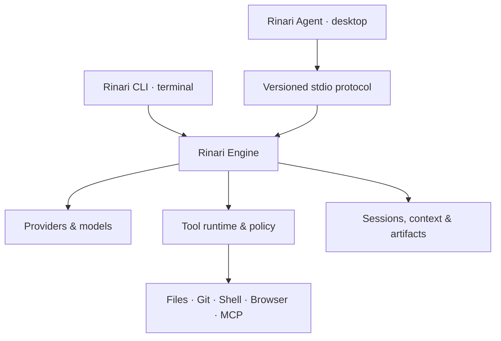

<div align="center">


# Rinari CLI

**An agent harness for real work in your terminal.**

Persistent sessions · Policy-controlled tools · Verifiable execution

[](https://github.com/Xainner/Rinari-CLI/actions/workflows/ci.yml)

[](LICENSE)

[Quick start](#quick-start) · [Capabilities](#capabilities) · [Architecture](#architecture) · [Documentation](#documentation) · [Desktop client](https://github.com/Xainner/Rinari-Agent)

</div>

---

Rinari connects language models to a durable execution environment: files, commands, Git, browsers, tools and project context. The harness owns permissions, approvals, budgets, cancellation and verification around the model loop.

This repository contains **Rinari Engine** and its **terminal client**. [Rinari Agent](https://github.com/Xainner/Rinari-Agent) exposes the same engine through a native desktop workspace.

> **Status:** Active development. Interfaces and packaging may evolve before stable v1. See the [roadmap](TODO.md) for implementation status and remaining release gates.

## Quick start

Requires **Python 3.11+**, **uv** and Git. Configure a model provider through setup.

```bash
git clone https://github.com/Xainner/Rinari-CLI.git
cd Rinari-CLI
uv sync
uv run rinari setup
uv run rinari doctor
```

When working from the source checkout, prefix commands with `uv run`. To make the command available outside the checkout:

```bash
uv tool install .
```

### A typical workflow

```bash
# Start a session in the current project
rinari

# Inspect before changing anything
rinari ask "Where is configuration validated?"

# Develop an implementation plan
rinari plan "Add JSON export to the report command"

# Implement and verify a task
rinari agent "Add tests for session persistence"

# Review the current changes
rinari review

# Continue in the desktop client, when installed
rinari code .
```

`rinari` detects project context. `rinari chat` explicitly starts a general conversation. Sessions retain their history and can be resumed with `rinari resume`.

## Capabilities

| Area | What the harness provides |
| :--- | :--- |
| **Execution** | Streaming agent loop, structured tool results, cancellation, queued prompts and progress monitoring. |
| **Sessions** | Durable CHAT and PROJECT sessions, context pins, resume reconciliation and project promotion. |
| **Providers** | Persistent provider/model catalogs, model-specific transports, connection checks and per-agent routing. |
| **Code tools** | Filesystem operations, shell, session processes, PTY, Git, repository search, tree-sitter and LSP integration. |
| **Context** | Memory retrieval, repository indexing, compaction and artifact references for large outputs. |
| **Verification** | Task dependencies, verification records, checkpoints and evidence-based completion gates. |
| **Extensibility** | Lazy-loaded skills, subagents, MCP, OpenAPI tools, plugins and lifecycle hooks. |
| **Observability** | Session events, traces, logs, metrics, usage and local diagnostics. |

### Permissions are part of execution

**PLAN** and **REVIEW** keep execution immutable. **BUILD** enables implementation subject to the selected policy. In desktop sessions, the selected read scope independently controls whether external filesystem reads are allowed, require approval or remain limited to the session root.

Tool calls pass through schema validation, policy checks, approvals and sandbox enforcement. Credential reads retain explicit handling, and provider credentials use supported credential backends. See [read-scope semantics](docs/plan-read-scope.md) and the [tool contract](docs/tools.md).

### Reusable procedures and delegated work

Packaged skills cover repository exploration, implementation, debugging, testing, review, refactoring, CI repair, research and final verification. Their procedures load when needed.

Built-in agents provide specialized exploration, implementation, review and verification roles, with model assignments, budgets, cancellation and workspace isolation. The engine remains the authority for their tools and permissions.

## Architecture



The engine owns the agent loop and persistent operational state. Clients present that state and submit actions through the application boundary. The desktop transport uses NDJSON requests, responses and session-scoped events:

```bash
rinari engine --stdio
```

Capabilities are negotiated at startup. Runtime snapshots support reconstruction after reconnects; large outputs stay in the artifact store.

## Command map

| Workflow | Commands |
| :--- | :--- |
| Work | `chat`, `ask`, `plan`, `agent`, `review`, `verify` |
| Continue | `session`, `resume`, `project`, `checkpoint`, `undo` |
| Configure | `setup`, `providers`, `models`, `agents`, `profiles` |
| Extend | `tools`, `skills`, `mcp`, `plugins`, `api`, `hooks` |
| Inspect | `status`, `doctor`, `context`, `artifacts`, `metrics`, `trace` |
| Control | `trust`, `permissions`, `approvals`, `sandbox`, `network` |
| Connect | `engine`, `code` |

Use `rinari --help` or consult the [complete command contract](docs/commands.md) for options, persistence rules and exit codes.

## Development

```bash
uv sync
uv run pytest tests/unit -q
uv run ruff check .
uv run ruff format --check .
uv build
```

Run `uv run pytest` for the full test suite. Follow [AGENTS.md](AGENTS.md) and the current phase in [TODO.md](TODO.md) when contributing.

## Documentation

| Guide | Contents |
| :--- | :--- |
| [Harness](docs/harness.md) | Runtime design and subsystem contracts |
| [Architecture](docs/stack.md) | Stack and architectural principles |
| [Commands](docs/commands.md) | Public CLI reference |
| [Tools](docs/tools.md) / [Skills](docs/skills.md) | Execution and procedure contracts |
| [Desktop protocol](docs/desktop/README.md) | Shared engine/client integration |
| [Troubleshooting](docs/troubleshooting.md) | Diagnostics and recovery |
| [Roadmap](TODO.md) | Delivery status and open work |

---

<div align="center">

**One engine. Terminal and desktop.**

[Rinari Agent](https://github.com/Xainner/Rinari-Agent) · [Issues](https://github.com/Xainner/Rinari-CLI/issues) · [MIT License](LICENSE)

</div>
